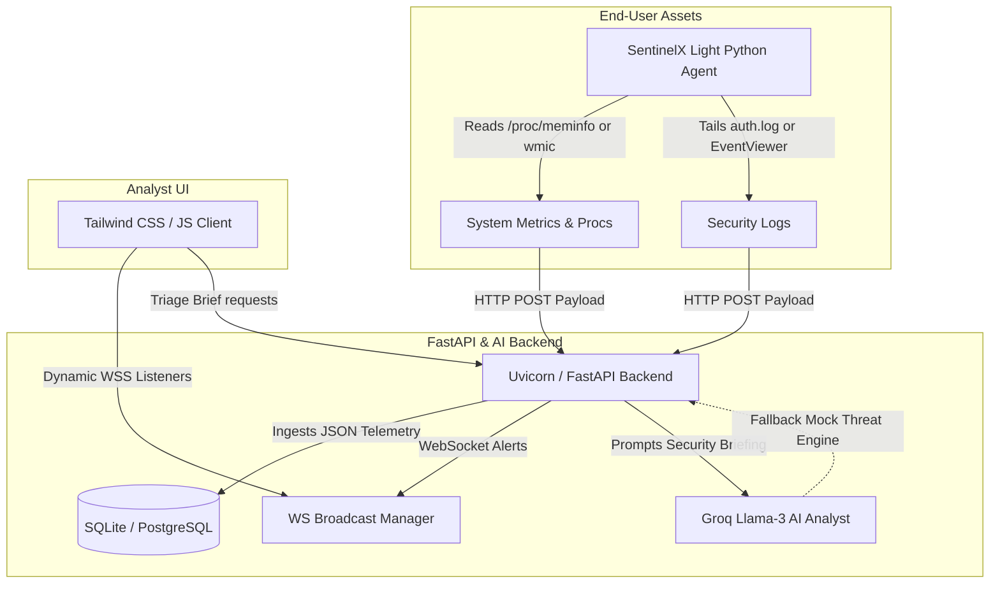

# SentinelX AI — Advanced Open-Source Security Operations Center (SOC)

[](https://opensource.org/licenses/Apache-2.0)
[](https://www.python.org/)
[](https://fastapi.tiangolo.com/)
[](#)

> **Enterprise-grade AI Threat Detection & Security Monitoring, built 100% free and open source.**
> SentinelX AI is a modern, tenant-isolated Security Operations Center (SOC) platform designed to ingest system metrics, track running processes, tail log streams from endpoint nodes, map alerts to the **MITRE ATT&CK Framework**, and deliver instant automated forensics using **Groq LLM Intelligence**.

---

## 🎨 SentinelX AI Logo Representation
*To generate a premium logo banner for this repository, use the following prompt in Midjourney, DALL-E 3, or Stable Diffusion:*
> **Prompt:** A high-tech digital shield logo, cybernetic circuit board pathways glowing neon cyan and electric indigo, metallic obsidian core with a stylized glowing letter 'S', dark cybersecurity hacker aesthetic, volumetric lighting, unreal engine render, 8k resolution, cinematic look, centered mockup --no frame, phone, mockup, mockups

---

## 🏛️ System Architecture



---

## ✨ Core Highlights
1. **AI-Powered Incident Briefings**: Decodes complex system/auth log alerts into natural language threat summaries, impact valuations, and custom NIST-aligned containment instructions using Groq LLM API (with rule-based offline fallbacks).
2. **Zero-Dependency Endpoint Agent**: A lightweight Python monitoring agent that measures CPU, RAM, and Disk spaces, fetches process matrices, and tails security authentication events without requiring `pip install` on target nodes.
3. **Interactive Simulation Range**: Test detection pipelines instantly with simulated attack vectors (SSH Brute Force, SQL Injections, Reverse Shell Persistence, Sudo Escalation Exploits) that streams live events directly to the dashboard.
4. **MITRE ATT&CK Matrix Mappings**: Automatically maps incoming endpoint violations to specific tactical categories (Initial Access, Execution, Credential Access, Privilege Escalation, Discovery, Exfiltration).
5. **Real-time WebSocket Feeds**: Features instant alert feeds with dynamic audio alerts, dashboard telemetry widgets, and report compliance exports (CSV/Printable PDF).

---

## 🚀 Desktop Quick Start (Run Locally)

SentinelX is designed to be runnable directly on your desktop out-of-the-box. The backend automatically serves the frontend static templates directly from port `8000`.

### Option 1: Automatic Desktop Launcher
Simply double-click the launcher script at the root directory:
* **Windows**: Double-click [start-sentinelx.bat](file:///C:/Users/adity/.gemini/antigravity/scratch/sentinelx-ai/start-sentinelx.bat)
* **Linux/macOS**: Open a terminal, make the script executable, and run:
  ```bash
  chmod +x start-sentinelx.sh
  ./start-sentinelx.sh
  ```

### Option 2: Manual Terminal Execution
If you prefer running steps manually:
1. Navigate to the `backend/` directory:
   ```bash
   cd backend
   ```
2. Set up and activate a virtual environment:
   ```bash
   python -m venv venv
   # On Windows
   call venv\Scripts\activate
   # On macOS/Linux
   source venv/bin/activate
   ```
3. Install dependencies:
   ```bash
   pip install -r requirements.txt
   ```
4. Run the FastAPI development server:
   ```bash
   python -m uvicorn backend.main:app --host 0.0.0.0 --port 8000
   ```
5. Open `http://localhost:8000` in your web browser.

> [!TIP]
> If you have a local **Ollama** server running or have a **Groq API Key**, add your key to `backend/.env` under `GROQ_API_KEY` to unlock live, context-aware AI threat analysis!

---

## 🌐 Free Cloud Hosting (Production Deployment)

You can deploy the platform permanently on free-tier cloud servers in under 5 minutes:

### 1. Backend API (Render.com)
1. Fork this repository to your GitHub account.
2. Log in to [Render.com](https://render.com) and click **New > Blueprint**.
3. Select your forked repository. Render will automatically parse the `render.yaml` file and spin up your Python uvicorn server.
4. Note your Render app service URL (e.g. `https://sentinelx-api.onrender.com`).

### 2. Frontend Console (Vercel)
1. Log in to [Vercel.com](https://vercel.com) and click **Add New Project**.
2. Select your forked repository.
3. Edit `vercel.json` or `frontend/vercel.json` and replace the target API URL (`https://sentinelx-api.onrender.com`) with your own Render backend URL.
4. Select the directory root (or set the root directory configuration in Vercel to `frontend`).
5. Click **Deploy**. Vercel will host your landing page and dashboard.

---

## 💻 Connecting Local Endpoint Agents

Once logged into your dashboard:
1. Navigate to the **Endpoints Manager** tab.
2. Copy the generated Python agent bootstrap command.
3. Paste and run it in a terminal on any target Windows/Linux machine:
   ```bash
   python3 -c "import urllib.request; exec(urllib.request.urlopen('http://localhost:8000/static/agent.py').read())" --token "[YOUR_JWT_TOKEN]" --server "http://localhost:8000"
   ```
4. The node will immediately register, show "Online" in the dashboard, and begin streaming system diagnostics and security log alerts.

---

## 🛠️ Project Structure
```text
sentinelx-ai/
├── Dockerfile                  # Container instructions
├── docker-compose.yml          # Container configuration
├── render.yaml                 # Render Blueprint configuration
├── vercel.json                 # Vercel deployment rewrite rules
├── start-sentinelx.bat         # Windows double-click launcher
├── start-sentinelx.sh          # Linux/macOS shell launcher
├── README.md                   # Project documentation
│
├── backend/
│   ├── .env                    # Local environment variables
│   ├── config.py               # Settings loader
│   ├── database.py             # SQLite DB connection
│   ├── models.py               # SQL Alchemy Tables schema
│   ├── main.py                 # FastAPI Routers & Seed files
│   ├── requirements.txt        # Backend dependencies
│   │
│   ├── auth/
│   │   └── security.py         # JWT session signatures
│   │
│   ├── ai_engine/
│   │   └── ai_analyst.py       # Groq client & Fallback briefing logic
│   │
│   ├── websocket/
│   │   └── websocket_manager.py # WS Ingestion broadcaster
│   │
│   └── static/
│       └── agent.py            # Zero-dependency endpoint script
│
└── frontend/
    ├── index.html              # Landing Page & Signups modals
    ├── dashboard.html          # Core Analyst Workspace HTML UI
    ├── vercel.json             # Frontend-isolated routing rewrites
    └── js/
        └── dashboard.js        # WS listeners, Charts, Chat & Simulator logic
```

---

## 📝 License
Distributed under the Apache 2.0 License. See `LICENSE` for more information.
